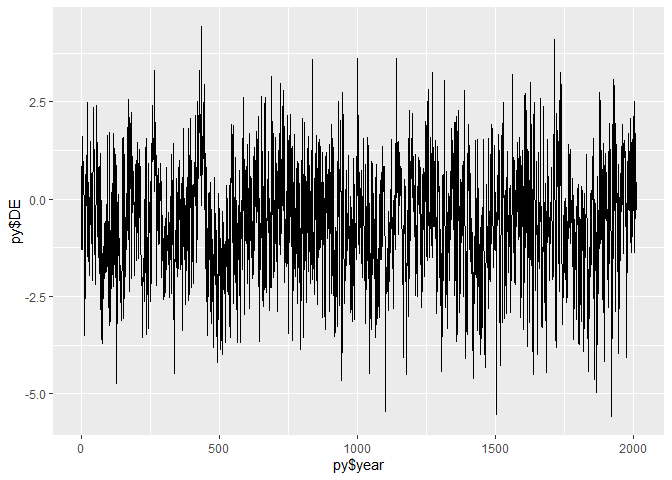

## cook 2015


OWDA (Old World Drought Atlas) as geoJSON

Derrived from: https://www.ncdc.noaa.gov/paleo-search/study/19419

Edward R. Cook, Richard Seager, Yochanan Kushnir, Keith R. Briffa, Ulf Büntgen, David Frank, Paul J. Krusic, Willy Tegel, Gerard van der Schrier, Laia Andreu-Hayles, Mike Baillie, Claudia Baittinger, Niels Bleicher, Niels Bonde, David Brown, Marco Carrer, Richard Cooper, Katarina Čufar, Christoph Dittmar, Jan Esper, Carol Griggs, Björn Gunnarson, Björn Günther, Emilia Gutierrez, Kristof Haneca, Samuli Helama, Franz Herzig, Karl-Uwe Heussner, Jutta Hofmann, Pavel Janda, Raymond Kontic, Nesibe Köse, Tomáš Kyncl, Tom Levanič, Hans Linderholm, Sturt Manning, Thomas M. Melvin, Daniel Miles, Burkhard Neuwirth, Kurt Nicolussi, Paola Nola, Momchil Panayotov, Ionel Popa, Andreas Rothe, Kristina Seftigen, Andrea Seim, Helene Svarva, Miroslav Svoboda, Terje Thun, Mauri Timonen, Ramzi Touchan, Volodymyr Trotsiuk, Valerie Trouet, Felix Walder, Tomasz Ważny, Rob Wilson and Christian Zang. 2015. Old World megadroughts and pluvials during the Common Era. Science Advances, 1(10), e1500561. doi: 10.1126/sciadv.1500561

https://doi.org/10.1126/sciadv.1500561

Demo Application using leaflet: https://climdata.github.io/cook2015/

## Download Files

Download files owda.txt & owda-xy.txt from:
 * https://www.ncdc.noaa.gov/paleo-search/study/19419
  * https://www1.ncdc.noaa.gov/pub/data/paleo/treering/reconstructions/europe/owda.txt
  * https://www1.ncdc.noaa.gov/pub/data/paleo/treering/reconstructions/europe/owda-xy.txt
  
(On Windows use cygwin and add it to PATH)  


```sh
[ -f ./download/owda.txt ] && mv -f ./download/owda.txt ./download/owda.bck.txt
wget -q -P download https://www1.ncdc.noaa.gov/pub/data/paleo/treering/reconstructions/europe/owda.txt
[ -f ./download/owda.txt ] && mv -f ./download/owda-xy.txt ./download/owda-xy.bck.txt
wget -q -P download https://www1.ncdc.noaa.gov/pub/data/paleo/treering/reconstructions/europe/owda-xy.txt
```

## Generate geoJSON files


```sh
python ./source/owda_geojson.py
```
Demo Application using leaflet: https://climdata.github.io/cook2015/


## Generate CSV file for Germany only


```sh
python ./source/owda_avg_germany.py
```

## Plot Drought time line


```r
#install.packages("ggplot2")
require("ggplot2")
```

```
## Loading required package: ggplot2
```

```
## Warning: package 'ggplot2' was built under R version 3.5.3
```

```r
#setwd(dirname(rstudioapi::getActiveDocumentContext()$path))
py <- read.csv("https://raw.githubusercontent.com/climdata/cook2015/master/csv/cook_de.csv", sep=",")
mp <- ggplot()
mp + geom_line(aes(y=py$DE, x=py$year)) 
```

<!-- -->


